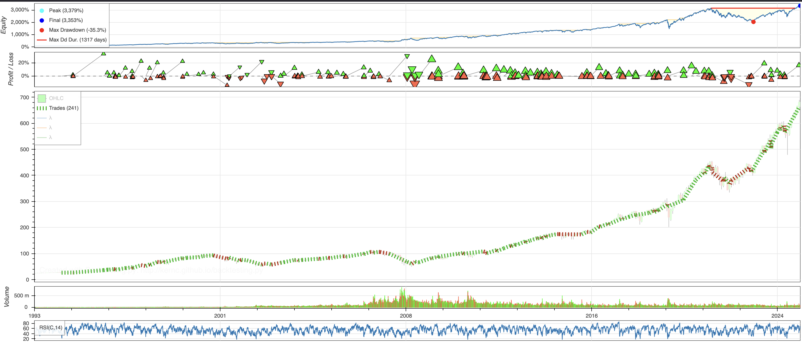
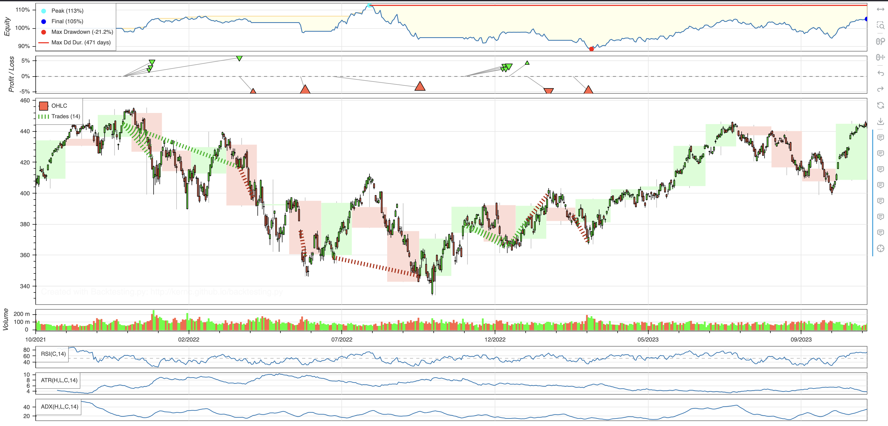
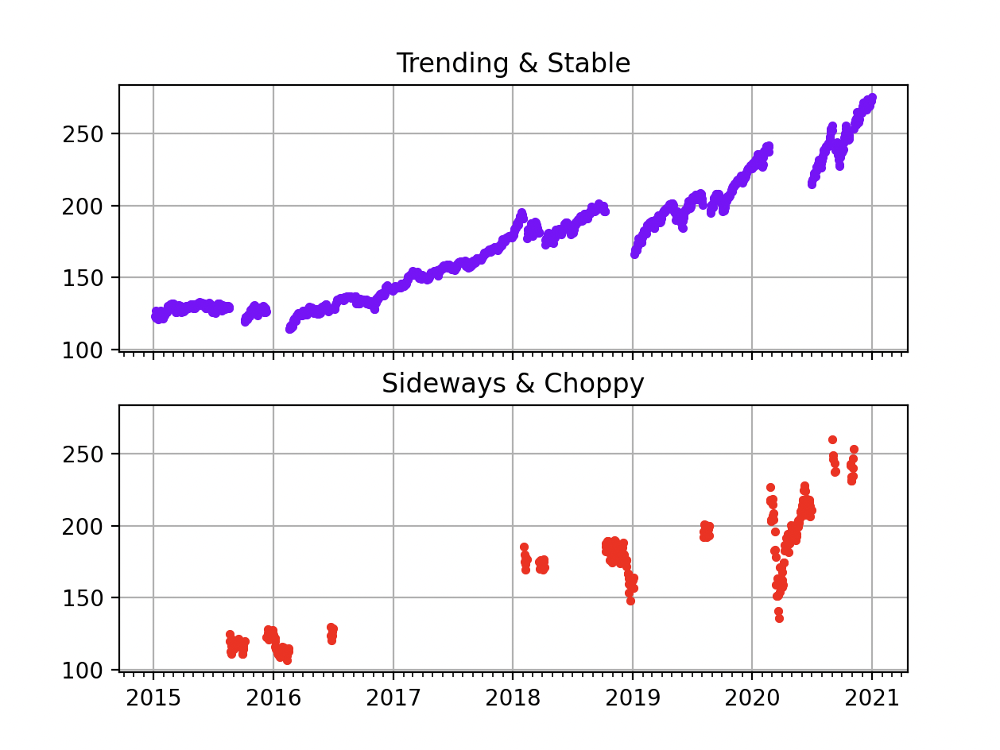

I was looking at the different large market indexes, when I noticed that market was either in sideways short choppy pattern or in a medium to long term trending pattern.

Used Backtesting Python library to test different strategies, some were really good however they only worked in a trending upward markets and would incur heavy losses in choppy volatile times.

Then after alot mistakes and backtesting I had two final modularized trade strategies :
Trending Strategy : Uses bollinger bands and 200 sma. Creates stable profits.                  
Sideways Strategy : Uses ATR multipliers, ADX theresholds, RSI bands. Plays safe, protects capital.

                    

Just Trending Strategy from 1993 to 2025, 
Return [%]                            3200
Buy & Hold Return [%]                 2500

But, we are incurring heavy losses in the choppy sideways parts of the market, as seen in red.

Sideways Strategy applied to one of the recent most unpredictable sideways markets.
Return [%]                            5.08816
Buy & Hold Return [%]                 1.50549

So in a scenario where Trending strategy is losing large amount of capital, Sideways Strategy can even profit some.

Now the most important part would be to be able to predict if the market is sideways or trending.
It does not matter how perfect the strategies are if they cannot be deployed in thier best eniroment.

Using mechanical methods with triggers was not enough to predict the regime of the market, as it depended on many latent and hidden variables.
But, there happens to be very specific types of ML Models that are regulary used by quantitatives. 

They are called HMMs - Hidden Markov Models. 
They by design assume that latent variables and states exist which are not observable directly. Thus when trained on a large dataset of market returns, as those returns were indirectly affected by the regime changes, fitting an HHM to the market return data allows for regime predictions.

The model trained on 1993 to 2015 data predicting using untested data.

Currently I am working on integration my strategies with its predictions, then next step is the backtesting.
